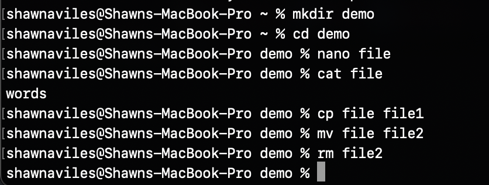

# Lab 02 

Week 2 Lab. Some commands reveal some sensitive information so I will be showing some sample ourputs or altered outputs where appropriate

## Command Line

- `hostname`
  - Returns the system's hostname which is the identity by which the system is recognized on a network
	```
	Shawn-MacBookPro-2.local
	```

- `env`
  - Outputs the environment variables the current user has set. The variables relay vital system and application-specific parameters
	```
	HOME=/Users/shawn (and many more...)
	```

- `ps`
  - Short for "process status" and it shows details about the currently executing processes
	```
	PID TTY           TIME CMD
	85428 ttys002    0:00.20 -zsh
	89199 ttys002    0:00.07 /Applications/Xcode.app/Contents/Developer/usr/bin/git clone https://github.com/kevinwlu/dsd.
	```

- `pwd`
  - Short for "print working directory" and displays the path to the current directory to the terminal
  ```
  /Users/shawn/Documents/cpe322/Labs/lab02
  ```

- `git clone https://github.com/kevinwlu/iot.git`
  - Clones the designated GitHub repository to the local machine, facilitating offline access and modification

- `cd iot`
  - Short for 'change directory' and moved the present working directory to the relative path supplied by the user i.e. to the "iot" directory

- `ls`
  - prints the files and subdirectories in the current directory
	```
	README.md               hype                    lesson4                 lesson9                 systems
	apps                    lesson1                 lesson5                 make                    tools
	cases                   lesson10                lesson6                 projects
	economics               lesson2                 lesson7                 special_problems
	health                  lesson3                 lesson8                 standards
	```

- `cd`
  - 'change directory' again however with no argument, it takes user to their home directory

- `df`
  - An abbreviation for "disk free," it displays the utilization and availability of disk space on the system's file systems. Sample output:
	```
	Filesystem		512-blocks      Used  		Available 	Capacity 	iused      	ifree 		%iused  	Mounted on
	/dev/disk3s1s1		1942700360  	23100744 	1460285232     	2%  		355382		4293063372    	0%   		/
	devfs			408       	408		0   		100%     	706        	0  		100%   		/dev
	...
	```

Screenshot for the following file commands.



- `mkdir demo`
  - Constructs a new directory named "demo" within the current working directory, in this case is the home directory

- `cd demo`
  - Modifies the present working directory to be changed to the recently created "demo" directory.

- `nano file`
  - Invokes the `nano` text editor for the purpose of creating or amending a file named "file".

- `cat file`
  - Renders the contents of the "file" to the terminal.

- `cp file file1`
  - Copies the contents of "file" into a newly created file named "file1".

- `mv file file2`
  - Renames or relocates (moves) "file" to "file2".

- `rm file2`
  - Deletes the file "file2" from the file system.

- `clear`
  - Purges the terminal display

- `man uname`
  - Displays manual page for the `uname` command, a reservoir of information and usage guidelines for the said command.
	```
	NAME(1)                                                   General Commands Manual                                                   UNAME(1)

	NAME
		uname – display information about the system

	SYNOPSIS
		uname [-amnoprsv]

	DESCRIPTION
		The uname command writes the name of the operating system implementation to standard output.  When options are specified, strings
		representing one or more system characteristics are written to standard output.
		...
	```

- `uname -a`
  - Fetches some comprehensive system information like system name, kernel version, and other details. Sample output
	```
	Darwin Shawns-MacBook-Pro-2.local 11.1.0 Darwin Kernel Version 11.1.1: Thu Jun  8 22:22:20 PDT 2023; root:xnu-1111.1111.0~0/RELEASE_ARM64_T6000 arm64
	```

- `ifconfig`
  - A system administration utility tool to view and adjust network interfaces on Unix systems. Sample:
	```
	lo0: ...
	gif0: ...
	stf0: ...
	anpi2: ...
	...
	```

- `ping localhost`
  - Directs a network request to the local machine, ascertaining network connectivity and responsiveness
	```
	PING localhost (127.0.0.1): 56 data bytes
	64 bytes from 127.0.0.1: icmp_seq=0 ttl=64 time=0.143 ms
	...
	```

- `netstat`
  - Dispenses comprehensive network statistics, encompassing connections, routing tables, and interface metrics.
	```
	Active Internet connections
	Proto Recv-Q Send-Q  Local Address          Foreign Address        (state)    
	tcp4       0      0  111.222.0.14.57219     11.22.33.222.https     ESTABLISHED
	tcp4       0      0  111.222.0.14.57218     22.22.33.222.https     ESTABLISHED
	```

