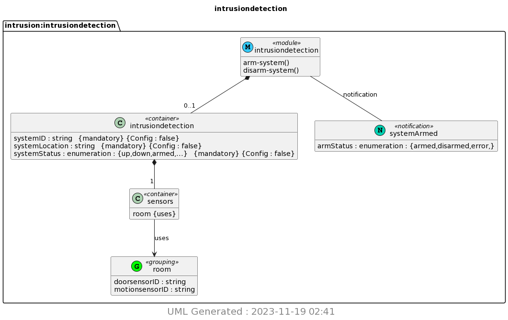

# CPE 322 - Lab 9

Lab provides students with experience using Yang and PlantUML

## Install pyang and PlantUML

- Not provided by anaconda so `pip` was used. 

## copy ~/iot/lesson9/intrusiondetection.yang to ~/demo

## Run pyang to generate intrusiondetection.yin and intrusiondetection.uml

## Run PlantUML to generate intrusiondetection.png

